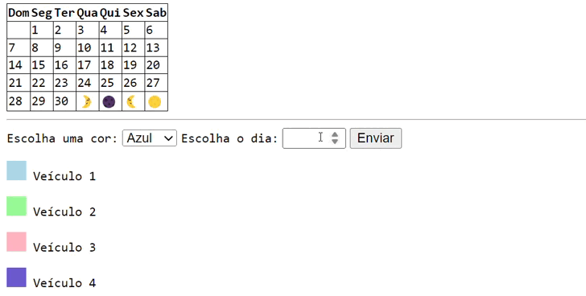

# ``Calendário``

## ``Índice``

* [Introdução](#introdução)
* [Descrição](#descrição)
* [Funcionalidade](#funcionalidades)
* [Fontes Utilizadas](#fontes-utilizadas)
* [Resultado](#resultado)
* [Publicação-Linkedin](#link-publicação-linkedin)
* [Autores](#autores)

## ``Introdução``
⭢ O projeto tem o objetivo de resolver o problema de uma empresa de transporte onde a solução deverá permitir ao colaborador(a) da área registrar no calendário em qual dia um determinado veículo terá que realizar o frete.   

## ``Descrição``
⭢ Montar um projeto que crie um calendário que, utilizando linguagem javascript, HTML5 e CSS3, permita a marcação de dias, atribuindo a eles a cor do veículo que fará o frente naquele dia. 
As cores podem ser: azul para o veículo 1, verde para o veículo 2, rosa para o veículo 3 e roxo para o veículo 4.
É preciso colocar uma legenda na aplicação que permite identificar a cor respectiva de cada veículo. 

## ``Funcionalidades``
⭢ Marcar os dias que irão precisar dos fretes no calendário e caso o indivíduo coloque uma data que não existe, deverá aparecer a mensagem "Data indisponivel".
 
## ``Fontes Utilizadas``
⭢ JavaScript, HTML5, CSS3.

## ``Código JavaScript``

## ``Resultado``

## ``Link publicação linkedin``
https://www.linkedin.com/posts/duda-fontinele-b87448303_fizemos-um-calend%C3%A1rio-para-agendamento-de-activity-7184567793386717184-EH7N?utm_source=share&utm_medium=member_desktop
 
 
## ``Autores``

⭢ Manuela Araujo dos Santos

⭢ https://github.com/camilacasagrande
 
⭢ https://github.com/dudafontinele
 
⭢ https://github.com/belsil5aa
